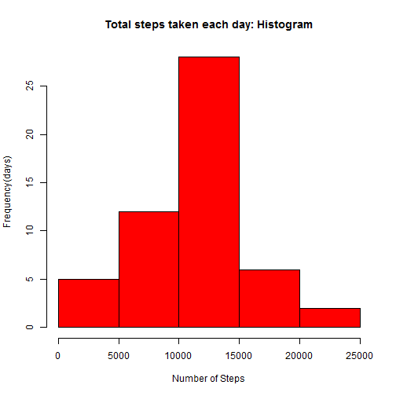
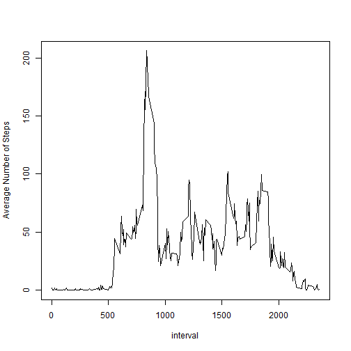
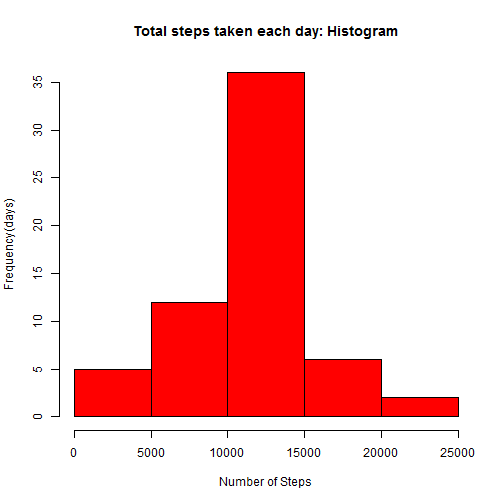

Project 1 - Activity Monitoring Devices data analysis
=====================================================

This is the report of the Repeoducible Research course's Project 1. I am going to analyse data from a personal activity monitoring device which collects data at 5 minute intervals throughout the day. I have been provided with a data set containing two months of data from an anonymous individual collected during the months of October and November, 2012 and include the number of steps taken in 5 minute intervals each day. The data can be found [here] (https://github.com/ACNestor/RepData_PeerAssessment1/blob/master/activity.zip):


## Loading and preparing the data

After downloading the data to my working directory, I load it into R, convert it into a data table and transform the variable date -which is read by R as a factor- into a date. I did not convert the interval variable into a time 
because I did not find necessary for the study:


```r
library(data.table)
library(knitr)
thedata<-data.table(read.csv("~\\DataScience\\04. Reproducible Research\\Project 1\\activity.csv"))
thedata$date = as.Date(thedata$date,"%Y-%m-%d")
```


## Studying the number of steps taken per day


In this step I compute the total steps taken per day, take the mean and the median and also make a 
histogram of that variable:


```r
StepsByDay <- thedata[!is.na(steps),.(DailySteps.Sum = sum(steps)),by=date]

hist(StepsByDay$DailySteps.Sum,col="red", main="Total steps taken each day: Histogram", 
     xlab="Number of Steps", ylab="Frequency(days)")
```

 

```r
mean(StepsByDay$DailySteps.Sum); cat("This value is the mean of the steps taken by day")
```

```
## [1] 10766.19
```

```
## This value is the mean of the steps taken by day
```

```r
median(StepsByDay$DailySteps.Sum); cat("This value is the median of the steps taken by day")
```

```
## [1] 10765
```

```
## This value is the median of the steps taken by day
```


## Studying the average daily activity pattern


In this step I study the average daily activity pattern. To this end, I create a time series plot of the 5-minute interval (y-axis) and the average number of steps taken (y-axis). Then I find the interval that contains the maximum average number of steps, which is 835 (corresponding to 08:35 in the morning).


```r
IntervalSteps <- thedata[!is.na(steps),.(Steps.Avg = mean(steps)),by=interval]
plot(IntervalSteps$interval,IntervalSteps$Steps.Avg,xlab="interval",ylab="Average Number of Steps",type="l")
```

 

```r
IntervalSteps[order(Steps.Avg,decreasing=TRUE)][1,interval]; cat("This is the interval with the maximum average number of steps")
```

```
## [1] 835
```

```
## This is the interval with the maximum average number of steps
```


## Imputing missing values


In this step I study the missing values and impute them some values so that there are no missing data any more. First I
compute how many rows with missing values are in the data. 


```r
nrow(thedata) - nrow(data.table(complete.cases(thedata))[V1==TRUE]); cat("Number of rows with NAs")
```

```
## [1] 2304
```

```
## Number of rows with NAs
```


Now I need to design a method to impute values to the missing data. First I investigate the NAs per variable, finding that there are only NAs in the steps variable. Therefore, a good and simple strategy could be to impute, to every missing value of the steps variable, the general average across all days of the steps for that 5-minute interval (actually and to be precise, the integer part of it, because the variable "steps" is an integer and the average can have decimals).  

Finally, I make again the histogram of the total number of steps taken each day and I calculate the mean and median total number of steps taken per day, in oreder to see the impact of imputing missing data. Comparing the mean and median obtained here with the values obtained in the first section it can be ovserved that the ones obtained here are smaller, which means that we have imputed low values of steps to the missing data.


```r
summary(thedata)
```

```
##      steps             date               interval     
##  Min.   :  0.00   Min.   :2012-10-01   Min.   :   0.0  
##  1st Qu.:  0.00   1st Qu.:2012-10-16   1st Qu.: 588.8  
##  Median :  0.00   Median :2012-10-31   Median :1177.5  
##  Mean   : 37.38   Mean   :2012-10-31   Mean   :1177.5  
##  3rd Qu.: 12.00   3rd Qu.:2012-11-15   3rd Qu.:1766.2  
##  Max.   :806.00   Max.   :2012-11-30   Max.   :2355.0  
##  NA's   :2304
```

```r
# Setting the keys for merging the data
setkey(thedata,interval)
setkey(IntervalSteps,interval)

# Performing the merge
thedata2<-merge(thedata,IntervalSteps,by="interval")

# Imputing the missing values actual values
thedata2$steps = as.numeric(thedata2$steps)
thedata3 <- thedata2[which(is.na(thedata2$steps)==TRUE), steps := floor(Steps.Avg)]
thedatanew <-thedata3[, 1:3, with = FALSE]

StepsByDay2 <- thedatanew[!is.na(steps),.(DailySteps.Sum = sum(steps)),by=date]

hist(StepsByDay2$DailySteps.Sum,col="red", main="Total steps taken each day: Histogram", 
     xlab="Number of Steps", ylab="Frequency(days)")
```

 

```r
mean(StepsByDay2$DailySteps.Sum); cat("This value is the new mean of the steps taken by day")
```

```
## [1] 10749.77
```

```
## This value is the new mean of the steps taken by day
```

```r
median(StepsByDay2$DailySteps.Sum); cat("This value is the new median of the steps taken by day")
```

```
## [1] 10641
```

```
## This value is the new median of the steps taken by day
```


